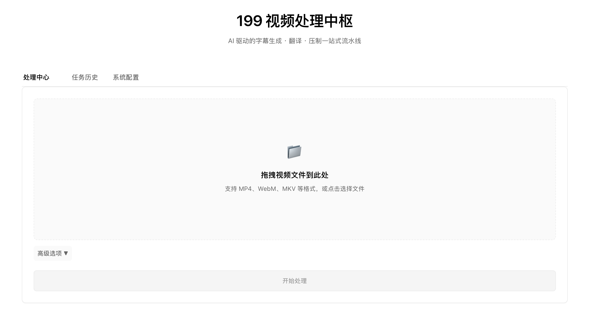
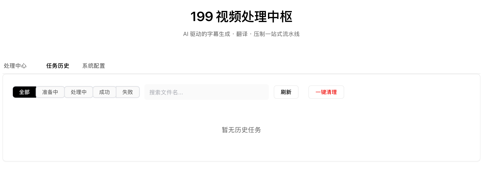

# SubtitleFlow

**AI 驱动的视频字幕流水线——从语音识别、智能翻译到压制，一站式处理英文视频，输出带双语字幕的中文成品。**

我有时会做一些视频搬运和二次加工。市面上有的工具，比如老牌的 Subtitle Edit，功能虽然强大，但不太对得上我的实际需求，尤其是**先调用大模型生成翻译提示词，再用大模型做整句翻译**这一整套流程，它们不支持或者操作很割裂。所以一开始我写了几个脚本来拼凑这个流程。

但后来发现，即使脚本能跑通，每天还是得花几分钟到半小时去手动操作、盯进度、处理中间文件——几分钟看起来不多，可对于一件可以自动化的事情，它就是一道无形的门槛，很容易磨掉做事的动力。要是真能做到**上传视频、点一下、等出结果**，那投入感会完全不同。所以我把这些脚本整合成了一个一体化的 Web 工具，也就是现在的 SubtitleFlow。

---

## 核心能力（和常规字幕工具的区别）

1. **上下文感知的语音识别**
   - 上传视频后，先从文件名推测领域（足球、篮球、F1 等），生成一份“ASR 提示词”（比如 `Bellingham → 贝林厄姆`、`Serie A → 意甲`），注入 Whisper 的 `initial_prompt`。
   - 这样 Whisper 在识别时会更倾向于把模糊发音识别成正确的专有名词，而不是常见的近似词。
   - 基于词级时间戳进行语义切分（标点>停顿>连词优先级），替代Whisper原生分段，断句效果大幅优于原生模型

2. **基于内容的翻译，而不是简单的逐句机翻**
   - 语音识别完成后，系统会采样部分字幕，调用大模型分析出真实的领域术语、话语风格，甚至常见的 ASR 错误（比如 `Serie R → 意甲`），把这些信息揉进翻译的 system prompt。
   - 翻译时，模型知道的不仅是“这句话怎么翻”，还有“整段视频在讲足球战术”、“这里的 `false nine` 应译为伪九号”。

3. **一站式内容分析**
   - 在翻译的同时，可选开启广告检测、内容摘要、推荐 5 个中文标题、标签提取等功能（需要在线 API 支持）。
   - 结果会保存在一个 JSON 元数据文件中，方便后续使用。

4. **Web 端操作与历史记录**
   - 拖拽上传 MP4，页面实时显示进度（百分比、已用时间、预计剩余时间）。
   - 所有处理过的任务都会保留在历史记录里，可以随时下载视频、中英文字幕或元数据，也可以批量清理。

---

## 技术架构

```
用户浏览器 (Vue 3 + Element Plus)
        ↓  HTTP
   FastAPI 后端 (Python)
        ↓  异步任务
   Pipeline 流水线 (4 步)
        ↓
 ┌─────────────────────────────────────────────┐
 │ Step 1: 标题分析 → 生成 ASR 提示词            │
 │ Step 2: faster-whisper 语音识别 → 英文 .srt  │
 │ Step 3: 内容分析 + 术语注入 + 批量翻译 → 中文 .srt │
 │ Step 4: 生成 ASS → FFmpeg 压制双语字幕         │
 └─────────────────────────────────────────────┘
```

- **前端**：单文件 HTML，Vue 3 + Element Plus（CDN 引入），不需构建。
- **后端**：Python 3.9+，FastAPI + aiosqlite（SQLAlchemy 异步）。
- **核心依赖**：faster-whisper, pysubs2, requests, transformers（可选）。

---

## 快速开始

### 你需要准备

1. **Python 3.10+**
2. **FFmpeg + FFprobe**（用于读取视频信息和压制字幕）
   - 下载地址：https://ffmpeg.org/download.html
   - Windows 用户下载后将 `bin/ffmpeg.exe` 和 `bin/ffprobe.exe` 的完整路径记下来备用
3. **faster-whisper 模型**（用于语音识别）
   - 推荐模型：`faster-whisper-large-v3-turbo`
   - HuggingFace 地址：https://huggingface.co/Systran/faster-whisper-large-v3-turbo
   - 下载后将**整个目录**放到本地某个位置，比如 `D:/models/faster-whisper-large-v3-turbo`
4. **翻译后端，三选一**（详见配置示例文件 `config.example.json`）：
   - 方案 A：在线 API（推荐，速度最快，翻译质量最高）
   - 方案 B：Ollama 本地部署（免费，但吃硬件，分析任务较慢）
   - 方案 C：本地 Transformers 直接加载模型（免费，但吃硬件，分析任务较慢）

### 克隆项目并安装依赖

```bash
git clone https://github.com/Xianrenshan/SubtitleFlow.git
cd SubtitleFlow
pip install -r requirements.txt
```

### 配置

复制示例配置文件，然后用文本编辑器打开，**所有路径必须使用绝对路径**填写：
关键字段示例：

```json
{
  "whisper": {
    "model_dir": "D:/models/faster-whisper-large-v3-turbo"
  },
  "ffmpeg": {
    "executable": "D:/tools/ffmpeg/bin/ffmpeg.exe",
    "ffprobe": "D:/tools/ffmpeg/bin/ffprobe.exe"
  },
  "online_api": {
    "base_url": "https://api.siliconflow.cn/v1/chat/completions",
    "api_key": "sk-你的API密钥",
    "model": "deepseek-ai/DeepSeek-V3"
  },
  "logo_path": ""
}
```

如果没有 LOGO，`logo_path` 留空即可；其他功能开关和细节可在配置文件中继续调整。

### 启动

```bash
python run.py
```

浏览器打开 `http://localhost:8000`，上传视频，等待处理完成即可下载成品。

---

## 使用流程

1. 在「处理中心」标签页拖拽或选择 MP4 文件。
2. 点击「开始处理」，页面会显示四个步骤的实时进度和预估剩余时间。
3. 完成后可直接下载：
   - 压制好的 MP4（带双语字幕）
   - 中文 SRT 字幕
   - 英文 SRT 字幕
   - 元数据 JSON（摘要、标题、广告片段等）

所有处理过的任务都会保留在「任务历史」中，支持下载和批量清理。

---

## 界面预览


---

## License

MIT
